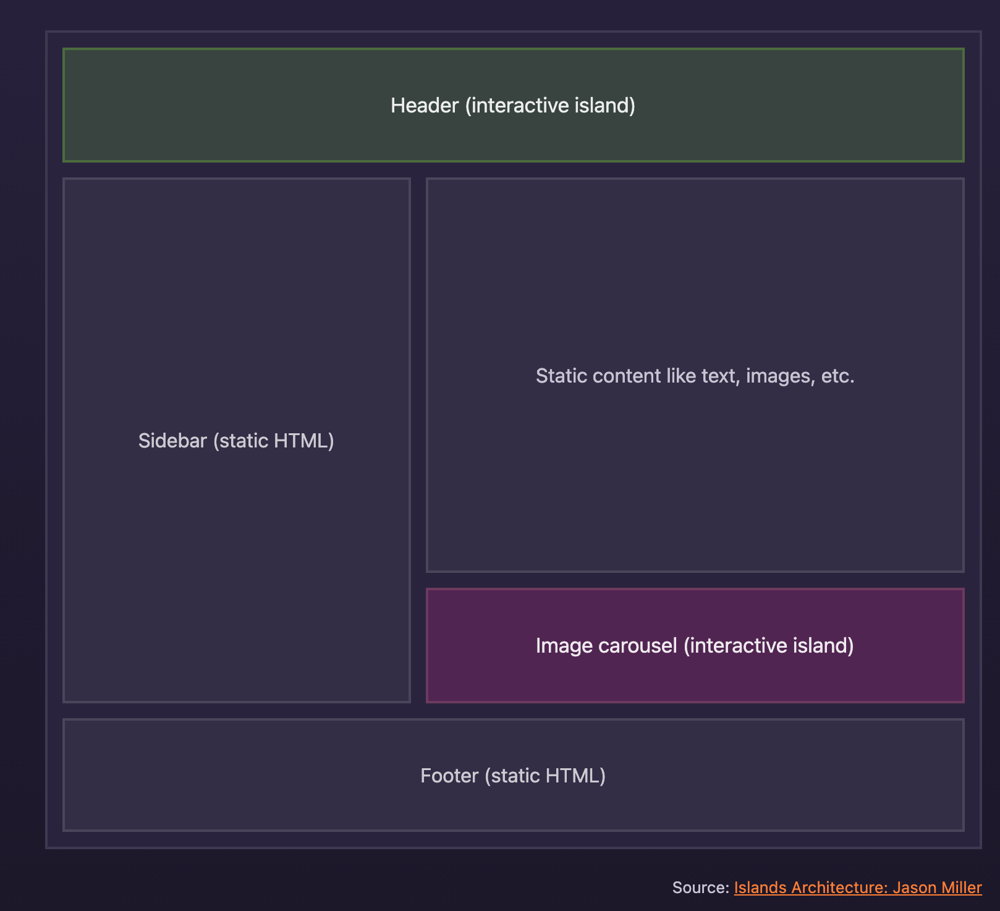

import islandImage from '/assets/islands.png'

## table of contents

## Core concepts

### Astro Islands (aka Component Islands)

> The idea of “islands architecture” was first coined by Etsy’s frontend architect Katie Sylor-Miller in 2019, and expanded on in this post by Preact creator Jason Miller.

`Astro Island` 指的是 HTML 靜態頁面上的交互式 UI 組件，一個頁面上可以存在多個 island。
將它們視為 static、non-interactive HTML 海洋中的島嶼。

然後在 Astro 中比較特別的是，我們可以用不同的框架 (React, Vue, Svelte) 來 implement 每個 island



#### How do islands work in Astro ?

> Astro generates every website with zero client-side JavaScript, by default.

Astro 預設 build 出來的頁面是 zero client-side JS, 所以打開 F12 觀察都只是單純的 HTML.

```js
---
// Example: Use a static React component on the page, without JavaScript.
import MyReactComponent from '../components/MyReactComponent.jsx';
---
<!-- 100% HTML, Zero JavaScript loaded on the page! -->
<MyReactComponent />
```

但有些時候一些需要 interactive 的 UI，還是需要 client-side 的 JS 被 load 近來，但 Astro 不會把整個頁面都變成 SPA，而是會幫你建立一個 Astro island

當補上 `client:load` 時，可以發現大部分頁面上還是靜態的 HTML + CSS, 而沒有因為這個 JS 的需求而改動道頁面上其餘的東西。

```js
---
// Example: Use a dynamic React component on the page.
import MyReactComponent from '../components/MyReactComponent.jsx';
---
<!-- This component is now interactive on the page!
     The rest of your website remains static and zero JS. -->
<MyReactComponent client:load />
```

#### What are the benefits of Islands?

主要是 performance

可以參考 [Template Directives Reference 🚀 Astro Documentation](https://docs.astro.build/en/reference/directives-reference/#client-directives)，裡面提供了不同的 client directives，再不同的情境底下可以用不同的策略來 load 進 JS。

- `client:load`
  - 一出現在頁面就 load
- `client:idle`
  - Lower-priority UI, 當頁面 load done, 且 `requestIdleCallback` 被 fired
- `client:visible`
  - Low-priority UI, 當出現在 user 的 viewport 才去 load, 這是用 `IntersectionObserver` 實作的。
- `client:media`
  - `client:media={string}` load on CSS media query is met.
- `client:only`
  - 跟 `client:load` 相似, 但在 build 時不會執行。然後要 expose
  - 要記得傳這 component 是什麼 framework

## Astro Component

### Component structure

上面放 JS, 下面放 HTML + JS, 上方區塊會用 `---` 來分割

```astro
---
// Component Script (JavaScript)
---

<!-- Component Template (HTML + JS Expressions) -->
```

ex 來寫一個 `buttonGroup` astro component

```astro
---
import Button from "./Button.astro";
---

<div>
  <Button title="Button 1" />
  <Button title="Button 2" />
  <Button title="Button 3" />
</div>
```

### The Component Script

code fence (---) 的概念就跟 markdown 一樣，都是用 `---` 來做區分。

我們可以在 script 的部份

1. import 其他的 astro componen

   t
2. import 其他的 framework, ex: Reac

   t
3. import data, ex: jso

   n
4. fetch data from API
5. creating variables 然後我們可以在 template 中使用

在這邊也可以用 typescript !

```astro
---
import SomeAstroComponent from "../components/SomeAstroComponent.astro";
import SomeReactComponent from "../components/SomeReactComponent.jsx";
import someData from "../data/pokemon.json";

// Access passed-in component props, like `<X title="Hello, World" />`
const { title } = Astro.props;
// Fetch external data, even from a private API or database
const data = await fetch("SOME_SECRET_API_URL/users").then((r) => r.json());
---

<!-- Your template here! -->
```

### The Component Template

在 template 有一些 directives 可以用, 可以參考 👉 [Template Directives Reference 🚀 Astro Documentation](https://docs.astro.build/en/reference/directives-reference/)

`class:list`, 這個其實就跟 `clsx` 的功能一樣，可以把後面帶的 classNames 串起來

```astro
---
// Your component script here!
import ReactPokemonComponent from "../components/ReactPokemonComponent.jsx";
const myFavoritePokemon = [
  /* ... */
];
---

<!-- HTML comments supported! -->
<h1>Hello, world!</h1>

<!-- Use props and other variables from the component script: -->
<p>My favorite pokemon is: {Astro.props.title}</p>

<!-- Include other components with a `client:` directive to hydrate: -->
<ReactPokemonComponent client:visible />

<!-- Mix HTML with JavaScript expressions, similar to JSX: -->
<ul>
  {myFavoritePokemon.map((data) => <li>{data.name}</li>)}
</ul>

<!-- Use a template directive to build class names from multiple strings or even objects! -->
<p class:list={["add", "dynamic", { classNames: true }]}></p>
```

### JSX-like Expressions

可以在 Astro component 中定義 js variables。然後，可以使用類似 JSX 的表達式將這些變量注入到的 HTML template.

但要注意的是, 這些變數不是 reactive, 他們只會在 build time 時執行一次。

#### Variables

```astro
---
const name = "Astro";
---

<div>
  <h1>Hello {name}!</h1>
  <!-- Outputs <h1>Hello Astro!</h1> -->
</div>
```

#### Dynamic Attributes

```astro
---
const name = "Astro";
---

<h1 class={name}>Attribute expressions are supported</h1>

<MyComponent templateLiteralNameAttribute={`MyNameIs${name}`} />
```

#### Dynamic HTML

```astro
---
const items = ["Dog", "Cat", "Platypus"];
---

<ul>
  {items.map((item) => <li>{item}</li>)}
</ul>
```

#### Dynamic Tags

在用 dynamic tags 要注意的是

1. 變數名稱需要大寫, ex: ✅ `Element = 'div'`, ❌ `element = 'div'`
2. Hydration directives are not supported. `client:*` 就是像這種 directive 就無法使用了。

```astro
---
import MyComponent from "./MyComponent.astro";
const Element = "div";
const Component = MyComponent;
---

<Element>Hello!</Element>
<!-- renders as <div>Hello!</div> -->
<Component />
<!-- renders as <MyComponent /> -->
```

### Fragments & Multiple Elements

跟寫 React 不同的是, astro 沒有限制一個 component 一定只能 return 一個 root element

所以不用包 fragment or `<></>`

```astro
---
// Template with multiple elements
---

<p>No need to wrap elements in a single containing element.</p>
<p>Astro supports multiple root elements in a template.</p>
```

但要包的話也是有 support

```astro
---
const items = ["Dog", "Cat", "Platypus"];
---

<ul>
  {
    items.map((item) => (
      <>
        <li>Red {item}</li>
        <li>Blue {item}</li>
        <li>Green {item}</li>
      </>
    ))
  }
</ul>
```

### Attributes

這邊就跟 JSX 不一樣了, astro 是走 kebab-case, 而非 JSX 的 camelCase

下面例子可以看到 `class` 的差異

```astro
- <div className="box" dataValue="3"></div> <-- 這是 JSX + <div
  class="box"
  data-value="3"
>
</div> <-- 這是 astro
```

### Component Props

可以從 `Astro.props` 來將 props 取出

```astro
---
// Usage: <GreetingHeadline greeting="Howdy" name="Partner" />
const { greeting, name } = Astro.props;
---

<h2>{greeting}, {name}!</h2>
```

```astro
---
import GreetingHeadline from "./GreetingHeadline.astro";
const name = "Astro";
---

<h1>Greeting Card</h1>
<GreetingHeadline greeting="Hi" name={name} />
<p>I hope you have a wonderful day!</p>
```

### Slots

slot 的概念和 Vue 的一樣

```astro
---
import Header from "./Header.astro";
import Logo from "./Logo.astro";
import Footer from "./Footer.astro";

const { title } = Astro.props;
---

<div id="content-wrapper">
  <Header />
  <Logo />
  <h1>{title}</h1>
  <slot />
  <!-- children will go here -->
  <Footer />
</div>
```

```astro
---
import Wrapper from "../components/Wrapper.astro";
---

<Wrapper title="Fred's Page">
  <h2>All about Fred</h2>
  <p>Here is some stuff about Fred.</p>
</Wrapper>
```

### Named Slots

named slots 的用法也是和 Vue 一樣

```astro
---
import Header from "./Header.astro";
import Logo from "./Logo.astro";
import Footer from "./Footer.astro";

const { title } = Astro.props;
---

<div id="content-wrapper">
  <Header />
  <slot name="after-header" />
  <!--  children with the `slot="after-header"` attribute will go here -->
  <Logo />
  <h1>{title}</h1>
  <slot />
  <!--  children without a `slot`, or with `slot="default"` attribute will go here -->
  <Footer />
  <slot name="after-footer" />
  <!--  children with the `slot="after-footer"` attribute will go here -->
</div>
```

```astro
---
import Wrapper from "../components/Wrapper.astro";
---

<Wrapper title="Fred's Page">
  
  <h2>All about Fred</h2>
  <p>Here is some stuff about Fred.</p>
  <p slot="after-footer">Copyright 2022</p>
</Wrapper>
```

### CSS styles

component template 也 support `<style>`, 可以在這寫 css, 然後這編寫的影響範圍都會是 scoped, 避免 css style conflict

然後 scoped css 影響到的範圍只有該 componnet template 所定義的 tag, children 和 imported component 則不會被影響到

```astro
---
// Your component script here!
---

<style>
  /* scoped to the component, other H1s on the page remain the same */
  h1 {
    color: red;
  }
</style>

<h1>Hello, world!</h1>
```

### load image to mdx

```astro
import imgReference from './image.png'; // imgReference === '/src/image.png'
import svgReference from './image.svg'; // svgReference === '/src/image.svg'
import txtReference from './words.txt'; // txtReference === '/src/words.txt' //
This example uses JSX, but you can use import references with any framework.
;
```

### Builtin Debug component

```astro
---
import { Debug } from "astro/components";
const sum = (a, b) => a + b;
---

<!-- Example: Outputs {answer: 6} to the browser -->
<Debug answer={sum(2, 4)} />
```
